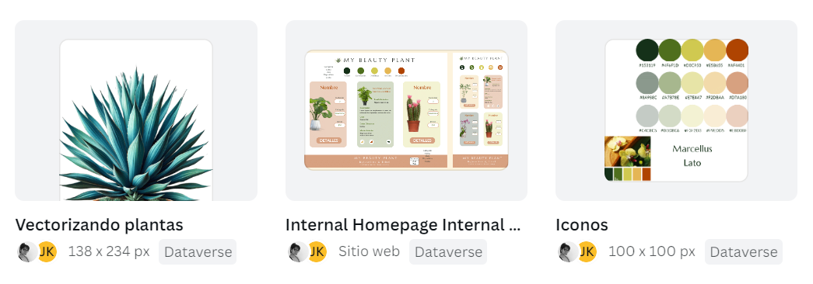
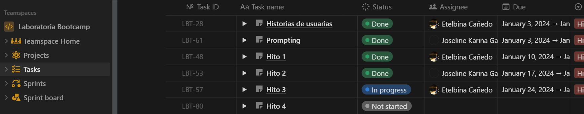
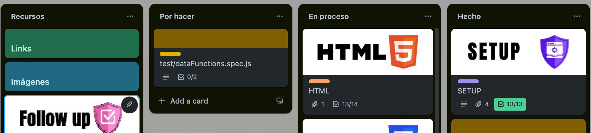
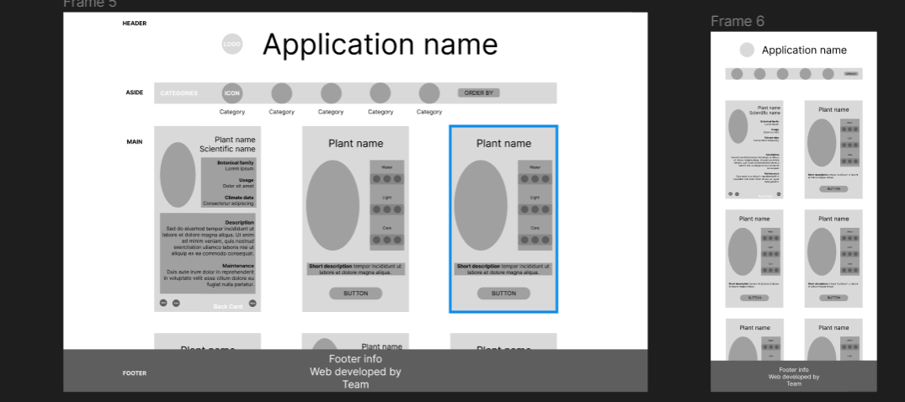
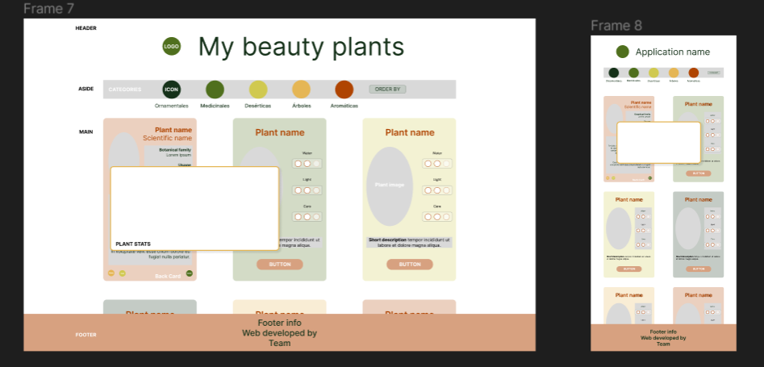
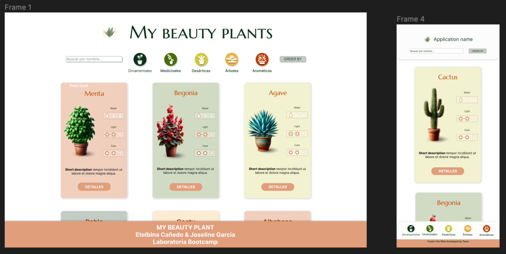

<div style="display: flex; flex-direction:column; justify-content: center; align-items: center;">
  <div style="display: flex; flex-direction: row; align-items: center;">
     
    <h1 style="text-align: center; margin-left: 10px;">My Beauty Plant</h1>
  </div>
    <!-- <p align="left" style="margin-top:50px;">
   
   </p> -->
</div>


## Índice

* [1. Descripción del Proyecto](#1-descripción-del-proyecto)
* [2. Características Destacadas 📌](#2-características-destacadas-📌)
* [3. Demostración](#3-demostración)
* [4. Tecnologías y Herramientas Utilizadas](#4-tecnologías-y-herramientas-utilizadas)
* [5. Enfoque de Desarrollo](#5-enfoque-de-desarrollo)
* [6. Prototipos](#6-prototipos)
* [7. Desarrolladoras](#7-desarrolladoras)
* [8. Conclusión](#8-conclusión)

***

## 1. Descripción del Proyecto
   <p align="left" style="margin-top:50px;">
   
   </p> 

<p style="text-align:justify">Nuestra aplicación web aborda la inquietud común sobre el cuidado de las plantas, ofreciendo respuesta a preguntas frecuentes, como frecuencia de riego, ubicación ideal, técnicas de poda, etc. Lo que distingue* a nuestra aplicación es su enfoque en simplificar el cuidado, proporcionando a los usuarios una guía intuitiva y estéticamente agradable.</p>

<p style="text-align:justify">Debido a la creciente tendencia de tener plantas en casa sin comprender completamente sus necesidades, iniciamos este proyecto como parte del bootcamp de Laboratoria. Para el futuro, planeamos expandir la aplicación incorporando datos más detallados y permitiendo a nuestros usuarios encontrar la planta perfecta según su estilo de vida y preferencias personales, a fin de brindarles una guia completa para el cuidado de sus plantas.</p>

## 2. Características Destacadas 📌

- Exploración Intuitiva: Navega sin problemas entre categorías para encontrar la planta perfecta, incluso si no tienes una variedad específica en mente. Encuentra tu planta ideal según su propósito o características deseadas.

- Búsqueda y Ordenación: Encuentra rápidamente la planta que buscas utilizando la función de búsqueda por nombre. Además, organiza el contenido según tus preferencias, facilitando la ubicación de la información que necesitas.

- Visualización Rápida de Cuidado: la función de visualización te permitira identificar fácilmente la dificultad de cuidado de una planta, así como sus necesidades de agua y exposición solar en una escala simple.

- Estadísticas por Categoría: Obtén una visión general de los requerimientos comunes dentro de una categoría para tomar decisiones más informadas.

- Descripciones Detalladas: Explora descripciones completas que proporcionan datos fascinantes sobre la planta seleccionada. Aprende más allá de los aspectos básicos y descubre información interesante para enriquecer tu experiencia con la planta.

## 3. Demostración 


## 4. Tecnologías y Herramientas Utilizadas 

### Proceso de Generación de Datos con IA

La información y las imágenes fueron generadas mediante inteligencia artificial utilizando prompts, y posteriormente, las imágenes fueron mejoradas y detalladas utilizando recursos como Canva. Este enfoque combinado de tecnologías de IA y herramientas de diseño permitió crear contenido informativo y visualmente atractivo.

```javascript
// Ejemplo ficticio de cómo se utilizó un prompt con OpenAI GPT-3 para obtener información sobre cuidado de plantas.
const prompt = "Genera un array con al menos tres objetos que representen plantas. Cada objeto debe tener propiedades como 'nombre', 'tipo' y 'cuidados'.";
const response = openAI.generate(prompt, { model: 'text-davinci-003', temperature: 0.7, max_tokens: 200 });

console.log(response);
```

### HTML5
```html
<!-- La base del contenido se construyó utilizando HTML5, garantizando una estructura semántica y accesible. -->
<div class="dropdown"> 
  <label for="itemOrder" id="order" class="dropbtn">Orden</label>
    <select name="order" id="itemOrder">
      <option value="order">Orden</option>
      <option value="a-z">A - Z</option>
      <option value="z-a">Z - A</option>
      <option value="seeAll">Reset all</option>
    </select>
</div>
```

### CSS
```css
/* La presentación visual y el estilo se lograron con CSS, asegurando una interfaz atractiva y amigable. */
.search-container input{
    width: 150px;
    height: 25px;
    padding: 5px;
    font-size: small;
    font-weight: bold;
    border-radius: 5px;
    border: #8A988C solid .5px;
    box-shadow: 1px 1px 5px gray;
}
```

### JavaScript
```js
// Se implementaron funcionalidades interactivas utilizando JavaScript puro, mejorando la experiencia del usuario.
const categoryButtons=document.querySelectorAll('.category');
categoryButtons.forEach(button => 
{
  button.addEventListener('click',(e)=> 
  {
    const category = e.target.getAttribute('data-category');
    currentData = filterData(data, 'categoryPlant', category);
    //console.log(filteredData)
    //console.log(e.target)
    if (activeSorting === 1) {
      sortData(currentData, "id", 1);
    } else if (activeSorting === 2) {
      sortData(currentData, "id", 2);
    }
    clearView();
    renderItems(currentData);
  });
});
```

### Pruebas con Jest
```javascript
// Jest se utilizó para garantizar la calidad y confiabilidad del código.

// Ejemplo de prueba para una función
test('suma dos números correctamente', () => {
  expect(sum(1, 2)).toBe(3);
});

// Ejemplo de prueba para una función asíncrona
test('recuperar datos de manera asíncrona', async () => {
  const data = await fetchData();
  expect(data).toBe('Datos recuperados');
});
```

### Prototipos
### Figma
Se utilizó Figma para la creación de prototipos (tanto de baja, media y alta fidelidad), permitiendo una planificación detallada de la interfaz de usuario y una colaboración eficiente entre los miembros del equipo.

<a href="https://www.figma.com/file/dSltZ7FoI402Us3GVLXwbD/Dataverse?type=design&node-id=58-3&mode=design&t=sQAXBv0lTt8r09VI-0">Prototipos de Baja Fidelidad</a>

<a href="https://www.figma.com/file/dSltZ7FoI402Us3GVLXwbD/Dataverse?type=design&node-id=137-500&mode=design&t=sQAXBv0lTt8r09VI-0">Prototipos de Media Fidelidad</a>

<a href="https://www.figma.com/file/dSltZ7FoI402Us3GVLXwbD/Dataverse?type=design&node-id=202-807&mode=design&t=sQAXBv0lTt8r09VI-0">Prototipos de Alta Fidelidad</a>


### Canva
Canva se empleó para mejorar y detallar las imágenes generadas por IA, proporcionando herramientas visuales adicionales para perfeccionar el contenido, asi como para crear prototipos de baja fidelidad.


### Organización
La organización del proyecto se gestionó utilizando Notion y Trello, plataformas colaborativas que facilitaron la planificación, el seguimiento y la comunicación eficaz entre los miembros del equipo.

### Notion 


### Trello 



### Testeos de Usabilidad
Se llevaron a cabo testeos de usabilidad para evaluar la eficacia y la experiencia del usuario. Estos procesos de prueba garantizaron que la aplicación fuera intuitiva y cumpliera con los objetivos previstos, proporcionando retroalimentación valiosa para mejoras continuas.

## 5. Enfoque de Desarrollo
"My Beauty Plant" se ha gestado bajo un enfoque de desarrollo que abarca más allá de la elección de tecnologías. Aspectos importantes de nuestro enfoque incluyen:

- Centrado en el Usuario: Desde la concepción hasta la implementación, hemos priorizado las necesidades y la experiencia del usuario para garantizar una aplicación intuitiva y útil.

- Colaboración Eficiente: La colaboración fluida entre los miembros del equipo se facilitó mediante herramientas como Notion y Trello. La comunicación efectiva fue clave para el progreso constante del proyecto.

- Iteraciones Continuas: Se adoptó un enfoque iterativo, permitiendo la mejora constante a través de ciclos de retroalimentación. La aplicación evolucionó a medida que recibíamos comentarios de usuarios y desarrolladores.

- Flexibilidad y Adaptabilidad: La arquitectura y el diseño se concebieron con la capacidad de adaptarse a futuras expansiones y mejoras, brindando flexibilidad para evolucionar con las necesidades cambiantes.

## 6. Prototipos
### Prototipos de Baja Fidelidad 


### Prototipos de Media Fidelidad 


### Prototipos de Alta Fidelidad 


## 7. Desarrolladoras

Con 💛 de <a href="https://www.linkedin.com/in/etelbina-ca%C3%B1edo-507baa1b5/">Etelbina Cañedo</a> & <a href="https://www.linkedin.com/in/joseline-garc%C3%ADa-0053521b2/">Joseline García</a>.

## 8. Conclusión
<p style="text-align:justify">"My Beauty Plant" representa nuestra dedicación para simplificar el cuidado de las plantas mediante una aplicación intuitiva y visualmente atractiva. A lo largo del proyecto, hemos fusionado inteligencia artificial con herramientas de diseño para crear contenido informativo y estéticamente agradable.</p>

<p style="text-align:justify">Mirando hacia adelante, planeamos expandir la aplicación, proporcionando aún más datos detallados y ayudando a los usuarios a encontrar la planta perfecta según sus preferencias. Agradecemos a todos por ser parte de esta experiencia verde y esperamos que "My Beauty Plant" continúe siendo una guía confiable para los amantes de las plantas.</p>


