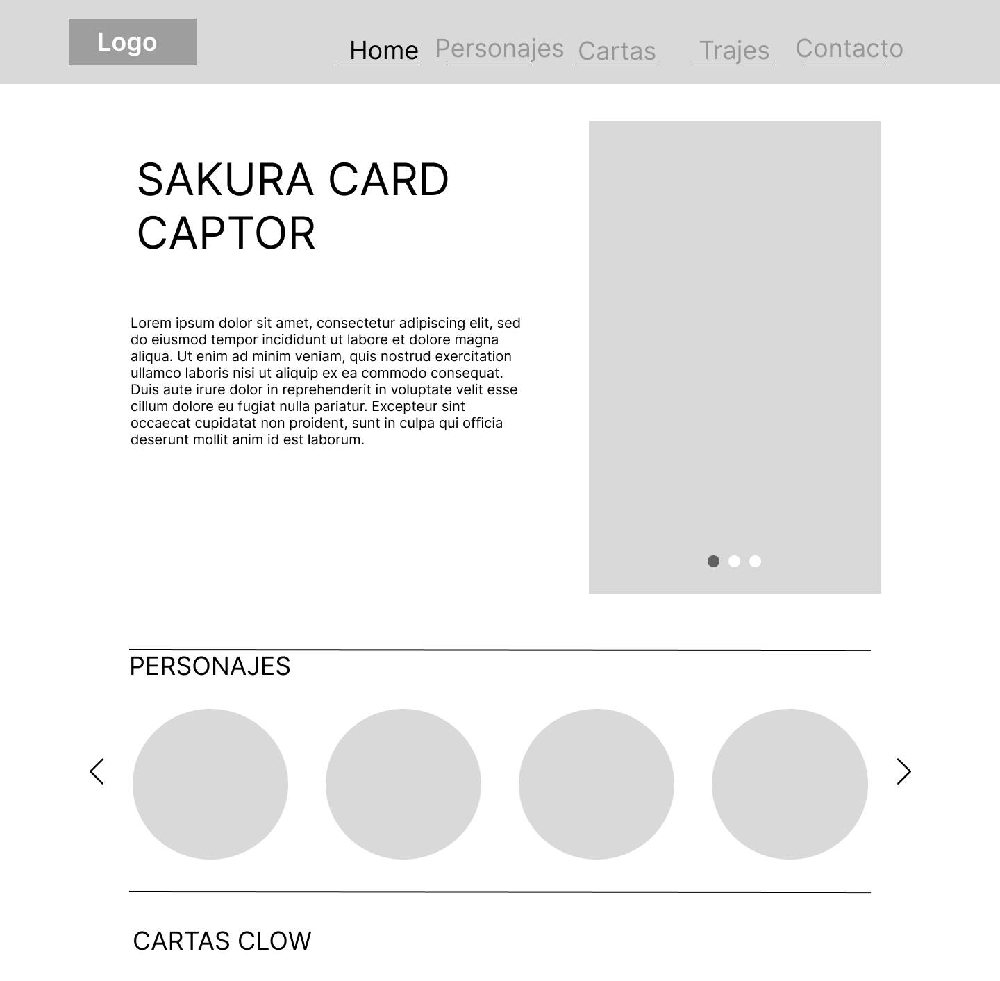
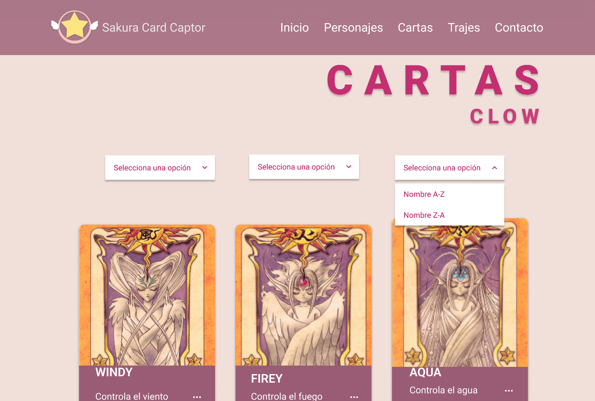
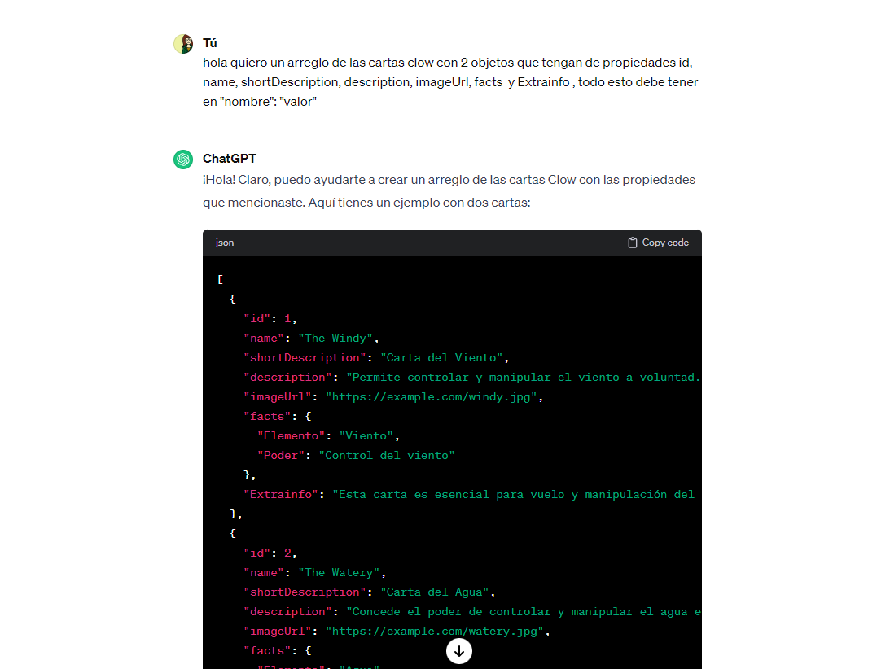
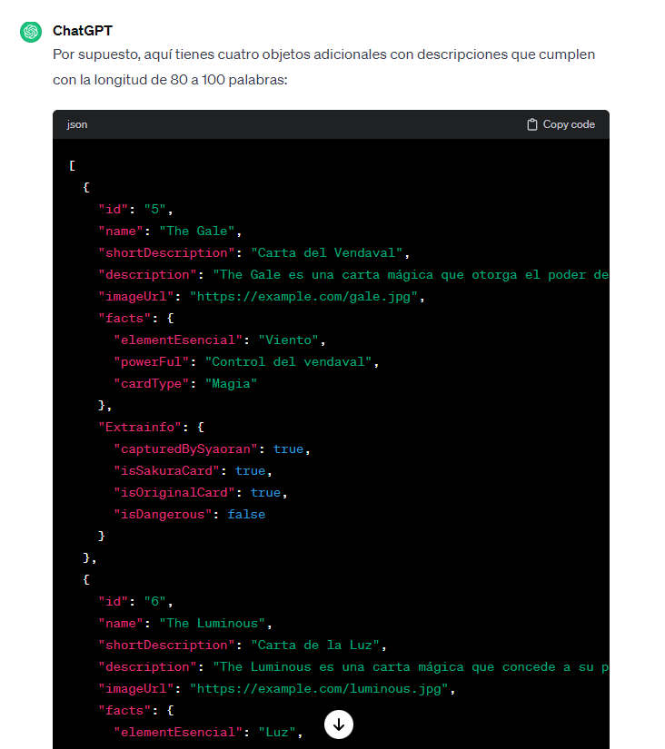

# Dataverse Sakura

## Índice

* [1. Resumen del proyecto](#2-resumen-del-proyecto)
* [2. Consideraciones generales](#3-consideraciones-generales)
* [3. Funcionalidades](#4-funcionalidades)
* [4. Consideraciones técnicas](#5-consideraciones-técnicas)
* [5. Criterios de aceptación mínimos del proyecto](#6-criterios-de-aceptación-mínimos-del-proyecto)
* [6. Hacker edition](#7-hacker-edition)
* [7. Objetivos de aprendizaje](#8-objetivos-de-aprendizaje)
* [8. Pistas, tips y lecturas complementarias](#9-pistas-tips-y-lecturas-complementarias)
* [9. Consideraciones para pedir tu Project Feedback](#10-consideraciones-para-pedir-tu-project-feedback)

***
## 1. Resumen del proyecto

En este proyecto se construyó una _página web_ para visualizar un
_conjunto (set) de datos_** que ve generó con [prompting](https://www.itmadrid.com/que-es-un-prompt-en-inteligencia-artificial-ia/).
 
Además, en este proyecto se utilizó herramientas de
[inteligencia artificial](https://es.wikipedia.org/wiki/Inteligencia_artificial)
como [ChatGPT](https://openai.com/chatgpt), [ExplainDev](https://explain.dev/),
entre otras para generar un set de datos en un archivo javascript.

El propósito de generar los datos en esta manera es brindar la oportunidad de
adentrarte en el empleo de herramientas impulsadas por la inteligencia
artificial, así como en [técnicas de
prompting](https://learnprompting.org/es/docs/intro).

Como entregable final la página web permite **visualizar la data,
filtrarla, ordenarla y calcular alguna estadística**. Con estadística
nos referimos a distintos cálculos que puedes hacer con los datos para mostrar
información aún más relevante a las usuarias (promedio, el valor máximo
o mínimo, etc).

## 2. Consideraciones generales

* Este proyecto se realizo de forma colaborativa en dupla.
* El rango de tiempo estimado fue de 4 sprints.
* El proyecto se entrego subiendo el código a GitHub (commit/push) y la
  interfaz se desplego usando [GitHub Pages](https://pages.github.com/).

## 3. Funcionalidades

Aquí definimos en más detalle las funcionalidades que tiene:

* La aplicación debe permite a la usuaria ver los items de la data en una visualización,
  de tipo tarjetas. Cada una de las tarjetas esta contenida en un elemento `<li>` y estos a su vez contenido en un elemento `<ul>`.

* El elemento `<ul>` es hijo de un elemento con atributo _id_
  de valor "root". 

* Las tarjetas resaltan los valores de las propiedades de la data que
  le interesaría a la usuaria ver. En este caso, tiene nombre de la carta y shortDescription de esta. Asi como un boton de ver más en donde se muestra las propiedades de descripcion de la carta, poder y si es peligrosa(estas serviran para posteriormente utilizarlas para filtar u ordenar). 

* La interfaz se estructura semánticamente, la data usa el estándar [microdatos](https://developer.mozilla.org/en-US/docs/Web/HTML/Microdata).
  Los atributos [`itemscope`](https://developer.mozilla.org/en-US/docs/Web/HTML/Global_attributes/itemscope),
  [`itemtype`](https://developer.mozilla.org/en-US/docs/Web/HTML/Global_attributes/itemtype)
  y el atributo [`itemprop`](https://developer.mozilla.org/en-US/docs/Web/HTML/Global_attributes/itemprop).

  Por ejemplo, la siguiente data correspondiente a Cartas de Sakura (dataset.js):

  ```json
    {
    "id": "1",
    "name": "Windy",
    "shortDescription": "Carta del Viento",
    "description": "The Windy es una poderosa carta mágica que otorga a su poseedor el control total sobre el viento. Con solo un gesto, el portador puede desencadenar ráfagas de viento huracanado o calmar suavemente la brisa. Su magia es esencial para los viajes aéreos y la manipulación del clima. Capturada por Syaoran, esta carta es parte fundamental del repertorio de Sakura. Con su naturaleza dócil, The Windy es una aliada valiosa. Es reconocida como una carta original y no representa un peligro significativo. ¿Será utilizada estratégicamente en las futuras batallas?",
    "imageUrl": "https://raw.githubusercontent.com/Elisantib/DEV013-dataverse/rama-Julia/src/imgs/windy.jpg",
    "facts": {
      "elementEsencial": "Climáticos",
      "powerFul": "Control del viento",
      "cardType": "Magia"
    }
  ```

  se estructuro de forma semánticamente en HTML como:

  ```html
  <li class="card" itemscope itemtype="Cards">
    <dl>
    <div class="card-front active">
      <dd class="img-container" itemprop="imagenUrl">
        
      </dd>
        <dd class="cardName" itemprop="name">${cartas.name} </dd>
        <dd class="cardDescription" itemprop="shortdescription">${cartas.shortDescription}</dd>
        <button class="card-button">Ver mas</button>
    </div>

  ```

* La aplicación debe calcula y visualiza una estadística de la data. 

* La aplicación permite a la usuaria filtrar la data, por la propiedad de elementos. `elementEsencial` y por la propiedad de si es peligrosa o no.  `isDangerous`


* La aplicación permite a la usuaria ordenar la data. Las funcionalidad tambien ordena sobre la data filtrada. Por ejemplo, si filtro las cartas con elemento Naturaleza y luego los ordeno por
  nombre ascendentemente, la aplicación mantiene el filtro aplicado y ordenar las cartas.

* La aplicación permite a la usuaria reiniciar la aplicación, limpiando
  filtros y ordenamiento, con un `<button>` con un atributo de datos
  `data-testid="button-clear"`.

* La aplicación es _responsive_, es decir, se visualiza sin problemas
  desde distintos tamaños de pantallas: móviles, tablets y desktops.

Los siguientes wireframes, son el prototipo de baja fidelidad y de alta fidelidad que se realizo para poder organizar las funciondalides y el diseño de la pagina.


Diseño baja fidelidad:

 

Diseño alta fidelidad:
.png>)



## 4. Consideraciones técnicas

La lógica del proyecto esta implementada completamente en JavaScript
(ES6), HTML y CSS. En este proyecto NO ese usó librerías o
frameworks, solo [vanilla JavaScript](https://medium.com/laboratoria-how-to/vanillajs-vs-jquery-31e623bbd46e).

El _boilerplate_ contiene una estructura de archivos como punto de partida así
como toda la configuración de dependencias:

```text
.
├── README.md
├── package.json
├── src
|  ├── data 
|  |  └── dataset.js (La que hayas generado con la IA)
|  ├── dataFunctions.js
|  ├── view.js
|  ├── index.html
|  ├── main.js
|  └── style.css
└── test
   └── data.js
   └── dataFunctions.spec.js
   └── tests-read-only

```

### Criterios del proyecto

#### Definición del producto

Se realizó una serie de preguntas para poder definir nuestros usuarios, el producto en el cual queriamos trabajar y cuales eran nuestros objetivos. Las preguntas fueron las siguientes:

¿Quiénes son las principales usuarias del producto?
Adolescentes, jovenes, publico que consumio el anime.

¿Cuáles son los objetivos de estas usuarias en relación con el producto?
Conocer más sobre el anime, conocer a los personajes.

¿Cuáles son los datos más relevantes que quieren ver en la interfaz y por qué?
Mostrar las cartas, los personajes y los oufits (vestimenta,opcional). Porque en el anime es lo que más destaca, lo mas llamativo. 

¿Cuándo utilizan o utilizarían el producto?
Cuando quieran conocer sobre las cartas, cuantas son, cuales son, de que tipo son. 
Conocer más a detalle los personajes o sobre el anime. 
 

#### Historias de usuario
Asi tambien, se realizo historias de usuario para poder trabajar cada funcionalidad y para poder planificar los sprints, dividiendo cada historia en tareas.

 


#### Generar los datos

Se generaron los datos con la temática de Cartas Clow del anime de Sakura Card Captor. Se utilizó el chatgpt para generarlos en el cual obtuvimos 1 array con 24 objetos con las siguientes propiedades a considerar:

* `id`: Identificador único (no pueden haber dos elementos con el mismo `id`).
  Debe ser un string de no más de 32 characteres, en minúscula, compuesto solo
  por letras, números, underscore (`_`) o guión (`-`). Por ejemplo: `"ada-lovelace"`.
* `name`: El nombre del personaje, país, película, etc.
* `shortDescription`: Descripción corta del elemento. Esta descripción deberá
  tener como máximo 20 palabras.
* `description`: Descripción extendida del elemento. Esta descripción deberá
  tener entre 80 y 100 palabras. Al momento de mostrar este dato en pantalla
  puedes truncarlo para que no ocupe tanto espacio.
* `imageUrl`: URL de la imagen. Esta imagen será generada a través de alguna
  herramienta basada en inteligencia artifical. Una vez generada la imagen,
  y guardada en tu repo, deberás agregar la URL en este campo.
* `facts`: Un objeto con al menos **3** "hechos" o "info" sobre este elemento, en
  formato `"nombre": "valor"`, por ejemplo:

  ```json
  "facts": {
    "elementEsencial": "Climáticos",
    "powerFul": "Control del viento",
    "cardType": "Magia"
  }
  ```

  Los _nombres de las propiedades_, deben estar en formato _camelCase_.
  Por ejemplo **ninguno** de los siguientes nombres sería válido:

  ```json
  "facts": {
    "elementEsencial": "Climáticos",
    "powerFul": "Control del viento",
    "cardType": "Magia"
  }
  ```

  Los _valores de las propiedades_, sólo pueden ser de tipo `number`, `boolean`
  o un `string` de no más de 64 caracteres (este **no** tiene restricciones sobre
  el tipo de caracteres que puede contener).
 
* `extraInfo`: Y por último un campo libre opcional, similar a `facts`. Si lo
  necesitas, aquí puedes poner cualquier otro tipo de información en formato
  donde puedes poner otra info que necesites en formato `"nombre": "valor"`,
  pero sin restricciones sobre el tipo de dato del valor. Por ejemplo:


#### Prompt utilizado


 


